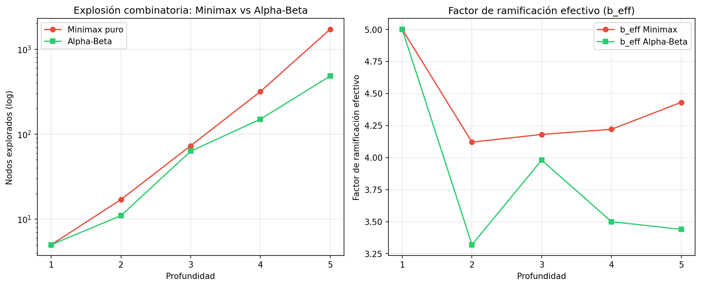
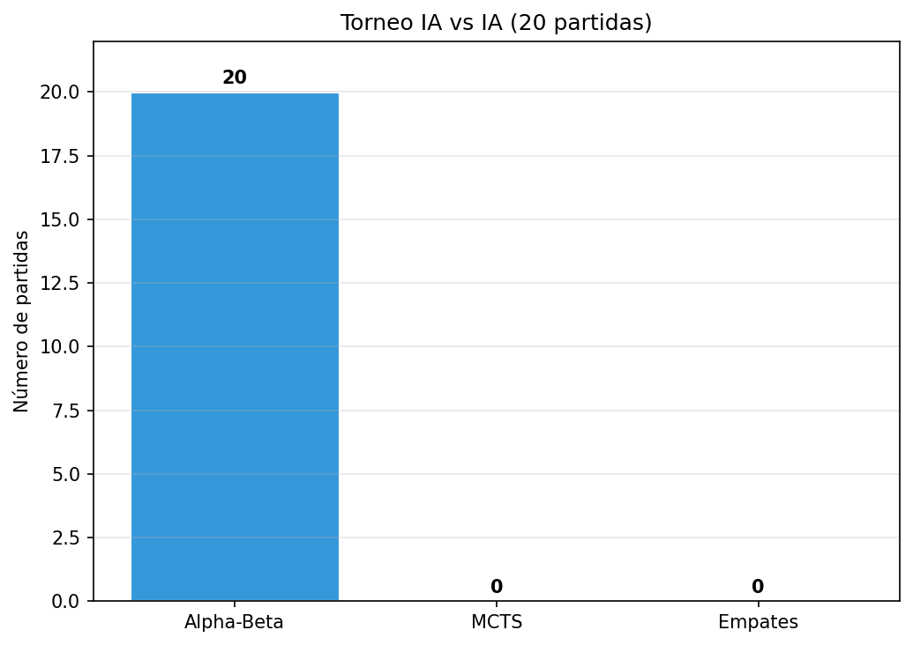

# Proyecto 3 — Othello IA Adversaria
**Inteligencia Artificial 2026 | Juegos de suma cero, información perfecta**  
**Autor:** andresm220  

---

## 1. Objetivo

Implementar un agente inteligente capaz de competir en **Othello (Reversi)** sobre un tablero 8×8, usando algoritmos deterministas y probabilísticos, con interfaz gráfica en Pygame.

---

## 2. Stack tecnológico

| Componente | Tecnología |
|---|---|
| Lenguaje | Python 3.12 |
| GUI | Pygame 2.6 |
| Cómputo numérico | NumPy |
| Gráficas de análisis | Matplotlib |
| Tests | pytest (14 tests) |

---

## 3. Arquitectura

El proyecto sigue una **separación estricta** entre lógica y visualización:

```
src/
├── constants.py          # Constantes globales (EMPTY/BLACK/WHITE, WEIGHTS, CORNERS...)
├── game_engine.py        # GameEngine: estado + reglas (sin Pygame)
├── heuristics.py         # 6 componentes heurísticos + detección de fase
└── agents/
    ├── base_agent.py     # Interfaz común (get_move, métricas)
    ├── human_agent.py    # Agente humano (recibe clic desde GUI)
    ├── alphabeta_agent.py
    ├── mcts_agent.py
    └── expectimax_agent.py

src/visualizer.py         # GUI Pygame (única capa que importa Pygame)
main.py                   # Punto de entrada + menú de selección
```

> `GameEngine` y todos los agentes son **puros** — sin importaciones de Pygame. La GUI los consume, nunca al revés.

---

## 4. Reglas de Othello implementadas

### 4.1 Tablero y posición inicial

- Tablero 8×8 indexado `[fila][columna]` con `0..7`
- Constantes: `EMPTY = 0`, `BLACK = 1`, `WHITE = 2`
- Posición inicial estándar:

```
. . . . . . . .
. . . . . . . .
. . . . . . . .
. . . W B . . .
. . . B W . . .
. . . . . . . .
. . . . . . . .
. . . . . . . .
```

- **Comienza NEGRO**

### 4.2 Movimientos válidos

Un movimiento es válido si y solo si coloca una ficha en una casilla vacía que **encierre al menos una ficha del oponente** en línea recta (8 direcciones), terminando en otra ficha propia.

### 4.3 Turnos y fin de juego

- Si un jugador no tiene movimientos → **pase automático**
- Si **ambos** no tienen movimientos → **fin de juego**
- También termina si el tablero está lleno
- Ganador: más fichas (empate posible en 32-32)

### 4.4 Tests de reglas (14/14 ✅)

| Test | Verifica |
|---|---|
| `test_initial_position` | Posición inicial exacta |
| `test_black_has_four_legal_moves_at_start` | Negro tiene exactamente 4 movimientos en apertura |
| `test_move_flips_in_one_direction` | Volteo correcto en una dirección |
| `test_move_flips_multiple_directions` | Volteo en múltiples direcciones |
| `test_turn_switches_after_move` | Cambio de turno |
| `test_pass_when_no_moves` | Detección de pase |
| `test_terminal_full_board` | Tablero lleno = terminal |
| `test_terminal_no_moves_for_anyone` | Sin movimientos = terminal |
| `test_winner_black` / `test_winner_white` | Determinación del ganador |
| `test_draw` | Empate 32-32 |
| `test_count_pieces_initial` | Conteo inicial (2, 2) |
| `test_clone_independence` | `clone()` independiente del original |
| `test_full_game_does_not_crash` | Partida completa sin errores |

```bash
$ pytest tests/test_rules.py -v
14 passed in 0.51s
```

---

## 5. Motor de juego — `GameEngine`

```python
class GameEngine:
    board: np.ndarray          # int8, 8×8
    current_player: int        # BLACK o WHITE

    def get_legal_moves(player=None) -> list[tuple]
    def is_legal_move(move, player=None) -> bool
    def apply_move(move) -> GameEngine      # voltea fichas + pase automático
    def clone() -> GameEngine               # copia profunda barata
    def is_terminal() -> bool
    def get_winner() -> int                 # BLACK, WHITE o 0
    def count_pieces() -> tuple[int, int]   # (negras, blancas)
    def evaluate(player) -> float           # delega en heuristics.py
```

**Diseño clave:** `clone()` copia solo el array NumPy y un entero — operación O(64) que los algoritmos de búsqueda llaman miles de veces por jugada.

---

## 6. Algoritmos de búsqueda

Todos los agentes heredan de `BaseAgent` y exponen métricas para la GUI:

```python
class BaseAgent:
    nodes_explored: int    # nodos explorados (o simulaciones en MCTS)
    last_move_time: float  # segundos usados en la última jugada
    last_value: float      # valoración del tablero de la jugada elegida
```

### 6.1 Alpha-Beta con Iterative Deepening

**Archivo:** `src/agents/alphabeta_agent.py`

Minimax con poda Alpha-Beta + iterative deepening para respetar el límite de tiempo.

**Pseudocódigo:**
```
depth = 1
while tiempo_restante > margen:
    val, move = search_root(engine, depth, deadline)
    best_move = move          ← se actualiza solo si la iteración completa
    depth += 1
return best_move              ← mejor jugada de la última iteración completa
```

**Características:**
- Poda Alpha-Beta estándar (nodos MAX y MIN)
- Ordenamiento de movimientos: esquinas primero → mayor peso posicional
- Corte de tiempo a **1.9 s** (margen de seguridad de 0.1 s)
- Conteo exacto de `nodes_explored`

**Resultado en apertura (2s budget):** ~300 nodos, alcanza profundidad 5-6.

---

### 6.2 Expectimax

**Archivo:** `src/agents/expectimax_agent.py`

Variante de Minimax que modela al oponente como **jugador subóptimo/incierto**: en los nodos del oponente se usa un **nodo de azar** (promedio uniforme) en lugar de minimizar.

```
MAX node  (self.player):  max de todos los hijos
CHANCE node (oponente):   promedio uniforme de todos los hijos
```

**Modelo elegido:** probabilidad uniforme sobre las jugadas legales del oponente. Captura la incertidumbre de enfrentarse a un humano o agente no determinista.

**Características:**
- Iterative deepening con límite 1.9 s
- Mismo ordenamiento de movimientos que Alpha-Beta

---

### 6.3 MCTS / UCT

**Archivo:** `src/agents/mcts_agent.py`

Monte Carlo Tree Search con la fórmula UCT para selección:

```
Score(n) = wins(n)/visits(n)  +  C × √(ln(visits(padre)) / visits(n))
```

Con `C = 1.41` (≈ √2) configurable.

**Cuatro fases por iteración:**

| Fase | Descripción |
|---|---|
| **Selección** | Bajar por el árbol eligiendo el hijo con mayor UCT score |
| **Expansión** | Añadir un nodo hijo no explorado (movimiento aleatorio entre los no probados) |
| **Simulación** | Rollout aleatorio uniforme hasta el final del juego |
| **Retropropagación** | Actualizar `wins` y `visits` en todos los ancestros |

**Presupuesto por tiempo:** `while perf_counter() - start < 1.9s`  
**Resultado en apertura (2s):** ~13 simulaciones completas.

---

## 7. Heurísticas

`evaluate(player)` combina **6 componentes** con pesos que varían según la fase del juego. Todos normalizados a `[-100, 100]`.

### 7.1 Componentes

| # | Componente | Fórmula |
|---|---|---|
| 1 | **Paridad de fichas** | `100 × (mías - rival) / (mías + rival)` |
| 2 | **Movilidad** | `100 × (mov_mías - mov_rival) / (mov_mías + mov_rival)` |
| 3 | **Control de esquinas** | Esquinas capturadas vs rival (normalizadas) |
| 4 | **Cercanía a esquinas** | Penalización por X/C-squares adyacentes a esquinas vacías |
| 5 | **Estabilidad** | Fichas en bordes ancladas a esquinas (no volteables) |
| 6 | **Peso posicional** | Suma de WEIGHTS para propias minus rival (normalizada) |

### 7.2 Matriz de pesos posicionales

```
120  -20   20    5    5   20  -20  120
-20  -40   -5   -5   -5   -5  -40  -20
 20   -5   15    3    3   15   -5   20
  5   -5    3    3    3    3   -5    5
  5   -5    3    3    3    3   -5    5
 20   -5   15    3    3   15   -5   20
-20  -40   -5   -5   -5   -5  -40  -20
120  -20   20    5    5   20  -20  120
```

Las esquinas (120) son las casillas más valiosas; las X-squares (-40) son las más peligrosas.

### 7.3 Estrategia por fases

| Fase | Condición | Prioridad |
|---|---|---|
| **Apertura** | < 20 fichas en tablero | Movilidad (0.40) + Posición (0.10), paridad ≈ 0 |
| **Juego medio** | 20–54 fichas | Balance movilidad + estabilidad + esquinas |
| **Cierre** | > 54 fichas | Paridad (0.50) domina — maximizar fichas |

```python
_PHASE_WEIGHTS = {
    "opening":  {"parity": 0.00, "mobility": 0.40, "corners": 0.25, ...},
    "midgame":  {"parity": 0.10, "mobility": 0.25, "corners": 0.30, ...},
    "endgame":  {"parity": 0.50, "mobility": 0.05, "corners": 0.25, ...},
}
```

---

## 8. GUI Pygame

### 8.1 Diseño (tema minimalista claro)

- **Ventana:** 870 × 620 px
- **Layout:** tablero 8×8 (izquierda) + panel de métricas (derecha)
- Fondo claro (#f5f5f0), tablero verde suave (#d4edda)

### 8.2 Funcionalidades

- Movimientos legales resaltados con puntos semitransparentes
- Última jugada marcada en amarillo
- Aviso de pase de turno en pantalla
- Pantalla de fin de juego con ganador y marcador final
- IA corre en **hilo separado** (`threading.Thread`) — la UI no se bloquea durante el cómputo

### 8.3 Panel de métricas (actualizado por jugada)

| Métrica | Descripción |
|---|---|
| **Turno** | Jugador actual (NEGRAS / BLANCAS) |
| **Negras / Blancas** | Conteo de fichas en tiempo real |
| **Nodos** | Nodos explorados (o simulaciones en MCTS) |
| **Tiempo** | Segundos usados en la última jugada |
| **Valor** | Valoración heurística del tablero |

### 8.4 Modos de juego

| Modo | Descripción |
|---|---|
| Humano vs Humano | Dos jugadores hacen clic en el tablero |
| Humano vs IA | El humano juega como Negras; la IA como Blancas |
| IA vs IA | La partida avanza automáticamente |

**Algoritmos seleccionables desde el menú:** Alpha-Beta · MCTS · Expectimax

---

## 9. Análisis de rendimiento

### 9.1 Explosión combinatoria

Comparación de nodos visitados entre **Minimax puro** y **Alpha-Beta** a las mismas profundidades, partiendo de la posición inicial.

| Prof | Minimax | Alpha-Beta | b_eff MM | b_eff AB | Reducción |
|:---:|---:|---:|:---:|:---:|:---:|
| 1 | 5 | 5 | 5.00 | 5.00 | 0% |
| 2 | 17 | 11 | 4.12 | 3.32 | 35% |
| 3 | 73 | 63 | 4.18 | 3.98 | 14% |
| 4 | 317 | 150 | 4.22 | 3.50 | 53% |
| 5 | 1,713 | 482 | 4.43 | 3.44 | **72%** |

> **b_eff** = nodos_totales^(1/profundidad) — mide el factor de ramificación efectivo. Alpha-Beta lo reduce de ~4.4 a ~3.4, lo que en la práctica significa explorar **3.5× menos nodos** a profundidad 5.



---

### 9.2 Torneo IA vs IA (20 partidas)

**Configuración:**
- Agente A: AlphaBetaAgent (2.0 s/jugada)
- Agente B: MCTSAgent (2.0 s/jugada, C=1.41)
- 10 partidas cada uno como Negras
- Límite estricto de 2 s/jugada

**Resultados:**

| | Victorias |
|---|:---:|
| **AlphaBeta** | **20** |
| **MCTS** | 0 |
| **Empates** | 0 |

**Análisis:** AlphaBeta domina completamente. Con iterative deepening llega a profundidad 5-6 usando heurísticas bien calibradas. MCTS con solo 2 segundos alcanza ~13 simulaciones completas desde la posición inicial — insuficiente para Othello donde el árbol de juego es profundo (~60 movimientos por partida). MCTS requeriría cientos de iteraciones para ser competitivo, lo que exigiría un presupuesto de tiempo mucho mayor.



---

## 10. Gestión del límite de tiempo (2 s/jugada)

Todos los agentes implementan el límite de tiempo con un **margen de seguridad de 0.1 s**:

| Agente | Mecanismo |
|---|---|
| AlphaBeta | Iterative deepening: aborta la iteración en curso si `perf_counter() >= deadline` |
| Expectimax | Ídem con `_TimeOut` exception |
| MCTS | `while perf_counter() - start < 1.9` en el bucle de simulaciones |

En todos los casos se devuelve la **mejor jugada encontrada hasta ese momento**, garantizando una respuesta siempre dentro del límite.

---

## 11. Ejecución

```bash
# Instalar dependencias
pip install pygame numpy matplotlib pytest

# Jugar
python main.py

# Tests de reglas
pytest tests/test_rules.py -v

# Análisis combinatorio (Minimax vs AlphaBeta)
python analysis/combinatorial.py

# Torneo 20 partidas
python analysis/tournament.py

# Generar todas las gráficas
python analysis/plots.py
```

---

## 12. Conclusiones

1. **Alpha-Beta con iterative deepening** es el agente más fuerte en Othello bajo un presupuesto de tiempo fijo — la poda reduce el espacio de búsqueda en ~72% a profundidad 5, permitiendo alcanzar profundidades 5-6 en 2 segundos.

2. **Las heurísticas son críticas**: la estrategia por fases (priorizar movilidad en apertura, paridad en cierre) mejora significativamente la calidad de juego frente a una función de evaluación estática.

3. **MCTS necesita más tiempo o mejores rollouts** para ser competitivo en Othello. Con rollouts aleatorios y solo 2 segundos, las simulaciones son insuficientes. Una mejora sería usar rollouts guiados por la heurística.

4. **Expectimax** es útil cuando el oponente es un humano o agente subóptimo — modela la incertidumbre en lugar de asumir juego perfecto del oponente.

---

## 13. Preguntas frecuentes (defensa)

---

### ¿Qué es una heurística y por qué es necesaria?

En juegos como Othello el árbol de juego tiene ~10^28 nodos posibles — es imposible llegar siempre al final. La heurística es una **función que estima qué tan buena es una posición sin llegar al estado terminal**. Le da al agente una "intuición" del valor de un tablero. Sin heurística, el agente solo podría jugar si resuelve el juego completo (inviable en tiempo real).

---

### ¿Por qué usas Alpha-Beta en lugar de Minimax puro?

Minimax explora **todos** los nodos del árbol. Alpha-Beta **poda** ramas que nunca podrán influir en la decisión final: si ya encontré un camino con valor X para el MAX, y el oponente tiene una jugada que lleva a algo ≤ X, ese sub-árbol se descarta. En la práctica reduce el espacio de búsqueda de O(b^d) a O(b^(d/2)) en el mejor caso — con el mismo tiempo se llega al **doble de profundidad**.

En los datos del proyecto: a profundidad 5, Minimax visita 1,713 nodos y Alpha-Beta solo 482 (**72% menos**).

---

### ¿Qué es el iterative deepening y por qué lo usas?

En lugar de buscar directamente a profundidad fija N, el agente busca primero a profundidad 1, luego 2, luego 3... hasta que se acaba el tiempo. Así siempre tiene una respuesta (la de la última profundidad completa) y nunca excede el límite de 2 segundos. El costo de repetir las búsquedas anteriores es pequeño comparado con la profundidad final.

---

### ¿Qué es el factor de ramificación efectivo (b_eff)?

`b_eff = nodos_totales ^ (1 / profundidad)`

Mide cuántos hijos "efectivos" tiene cada nodo en promedio. En Othello sin poda, b_eff ≈ 4.4. Con Alpha-Beta baja a ≈ 3.4. Esto significa que Alpha-Beta se comporta como si el árbol tuviera un factor de ramificación ~23% menor — por eso llega más profundo con el mismo tiempo.

---

### ¿Qué es Expectimax y cuándo conviene usarlo?

Expectimax reemplaza los **nodos MIN** (oponente perfectamente racional) por **nodos de azar** (promedio de los valores de todos sus hijos). Modelamos al oponente como si eligiera movimientos de forma uniforme aleatoria. Conviene cuando el oponente es **humano o subóptimo** — Minimax sobreestima la amenaza del rival asumiendo que siempre jugará perfecto, lo que puede llevar a decisiones excesivamente conservadoras.

---

### ¿Por qué MCTS perdió los 20 juegos contra Alpha-Beta?

MCTS con 2 segundos alcanza solo ~13 simulaciones completas desde la posición inicial de Othello. Cada simulación es un rollout aleatorio de ~60 movimientos — con tan pocas muestras la estimación estadística es muy ruidosa. Alpha-Beta con buenas heurísticas y profundidad 5-6 tiene una visión determinista mucho más precisa del árbol. Para ser competitivo, MCTS necesitaría cientos de simulaciones (más tiempo) o rollouts guiados por heurística en lugar de aleatorios.

---

### ¿Por qué las esquinas son tan importantes en Othello?

Las esquinas **nunca pueden ser volteadas** — una vez capturadas son permanentes. Además anclan los bordes: una fila completa desde la esquina también se vuelve estable. Por eso tienen peso 120 en la matriz posicional (el mayor), y las X-squares (diagonales a las esquinas) tienen -40 porque cederlas regala la esquina al oponente.

---

### ¿Por qué los pesos de la heurística cambian según la fase?

- **Apertura:** pocas fichas, el tablero está abierto. Lo que importa es tener **movilidad** (más opciones) y no caer en X/C-squares. La paridad (cantidad de fichas) no importa — tener pocas fichas en apertura es bueno porque son más difíciles de voltear.
- **Juego medio:** se balancean movilidad, estabilidad y control de esquinas.
- **Cierre:** el árbol es pequeño, casi todo es resoluble. Lo que determina el ganador es la **cantidad de fichas**, así que paridad sube a peso 0.50.

---

### ¿Qué es la estabilidad en Othello?

Una ficha es **estable** si ya no puede ser volteada en ninguna jugada futura. Las esquinas son siempre estables; los bordes anclados a esquinas también. La heurística premia tener fichas estables y penaliza las "frontera" (expuestas a volteo). Es uno de los componentes más importantes en juego medio y cierre.

---

### ¿Cómo garantizan que la IA no supere los 2 segundos?

Todos los agentes calculan un `deadline = inicio + 2.0 - 0.1` (margen de 100ms). En Alpha-Beta y Expectimax, cada nodo verifica `perf_counter() >= deadline` y lanza una excepción `_TimeOut` que aborta la búsqueda, devolviendo la mejor jugada de la iteración anterior. En MCTS, el bucle principal es `while perf_counter() - start < 1.9`. Siempre se devuelve una jugada válida.

---

### ¿Por qué separar la lógica del juego de la GUI?

Es un requisito explícito del enunciado y buena práctica de software. Permite:
1. **Testear** el motor de juego sin necesitar pantalla (`pytest` corre sin Pygame)
2. **Reutilizar** los agentes en análisis headless (torneo, combinatoria)
3. **Mantener** cada capa independientemente sin que un cambio en la GUI rompa la lógica

La GUI solo llama a `engine.get_legal_moves()`, `engine.apply_move()` y `agent.get_move()` — no conoce nada del interior de los algoritmos.

---

### ¿Cómo funciona el modo IA vs IA sin bloquearse?

La IA corre en un **hilo separado** (`threading.Thread`). Mientras el agente piensa, el event loop de Pygame sigue procesando eventos (como cerrar la ventana con ESC). Cuando el hilo termina, guarda el movimiento en `self._ai_move`. El loop principal lo detecta, lo aplica al tablero y lanza el siguiente hilo para el otro agente.

---

### ¿Qué pasa si un jugador no tiene movimientos legales?

`apply_move()` maneja el pase automáticamente: después de aplicar un movimiento, verifica si el rival tiene movimientos. Si no los tiene, **vuelve a asignar el turno al jugador actual** en lugar de pasarlo. Si ninguno tiene movimientos, `is_terminal()` retorna `True` y el juego termina. Esto cumple exactamente las reglas de Othello: el pase no es voluntario, y si ambos están bloqueados, se acaba.

---

### ¿Por qué el MCTS usa C = 1.41 (≈ √2)?

El término de exploración en UCT es `C × √(ln(N) / n)`. Con C = √2 se demuestra teóricamente que el algoritmo converge al óptimo minimizando el arrepentimiento (regret) en el problema del bandido multibrazo. En la práctica es un buen punto de partida — valores más altos exploran más (útil con poco tiempo), valores más bajos explotan más (útil con muchas simulaciones).

---

### ¿Qué entregarías diferente si tuvieras más tiempo?

1. **Tabla de transposición** en Alpha-Beta con Zobrist hash — evita recalcular posiciones repetidas
2. **Rollouts guiados** en MCTS usando la heurística para sesgar el rollout hacia jugadas más prometedoras
3. **RAVE / MCTS-GRAVE** para acelerar la convergencia del árbol MCTS
4. **Ventanas de aspiración** en Alpha-Beta para acelerar la búsqueda en iteraciones profundas
